## Capítulo IV: Product Design

### 4.1. Style Guidelines

#### 4.1.1. General Style Guidelines
[Pendiente]

#### 4.1.2. Web Style Guidelines
[Pendiente]

### 4.2. Information Architecture

#### 4.2.1. Organization Systems
[Pendiente]

#### 4.2.2. Labeling Systems
[Pendiente]

#### 4.2.3. SEO Tags and Meta Tags
[Pendiente]

#### 4.2.4. Searching Systems
[Pendiente]

#### 4.2.5. Navigation Systems
[Pendiente]

### 4.3. Landing Page UI Design

#### 4.3.1. Landing Page Wireframe
[Pendiente]

#### 4.3.2. Landing Page Mock-up
[Pendiente]

### 4.4. Web Applications UX/UI Design

#### 4.4.1. Web Applications Wireframes
[Pendiente]

#### 4.4.2. Web Applications Wireflow Diagrams

<table>
  <tr>
    <td class="header">User Persona</td>
    <td>Cliente - dueño del vehículo</td>
    <td class="header">Número</td>
    <td>1</td>
  </tr>
  <tr>
    <td class="header">User Goal</td>
    <td colspan="3" class="italic bold">
      Ingresar al sistema, visualizar y consultar el estado de mi vehículo mediante un código de seguimiento, para conocer el progreso del servicio, el diagnóstico y la fecha estimada de entrega sin necesidad de contactar directamente al taller.
    </td>
  </tr>
  <tr>
    <td class="header">Happy path</td>
    <td colspan="3">
       El usuario tiene la opción de acceder a la plataforma mediante el botón “Get Started”. Al seleccionarlo, el sistema redirige a la pantalla de inicio de sesión, en la cual el cliente ingresa sus credenciales (correo electrónico y contraseña).
Una vez autenticado correctamente, el sistema presenta la pantalla de ingreso de código de seguimiento, donde el usuario introduce el identificador proporcionado por el taller. Como paso adicional de validación, se muestra una segunda pantalla para el ingreso de un código de 4 dígitos, reforzando la seguridad del acceso.
Tras validar el código, el sistema redirige al usuario a la pantalla principal “Mi vehículo”, donde se visualiza un resumen del estado actual del servicio, incluyendo el progreso general, el estado (por ejemplo, en proceso) y accesos a información clave.
Finalmente, el usuario puede acceder al detalle completo del servicio, donde el sistema muestra información más específica como:

- Estado de cada etapa (recibido, diagnóstico, reparación, completado)
- Porcentaje de avance
- Técnico asignado
- Ubicación del vehículo dentro del taller
- Fecha estimada de entrega
    </td>
  </tr>
</table>

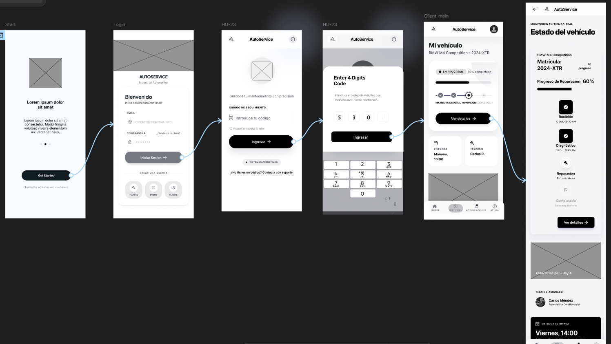
Wireflow Diagram - 1  
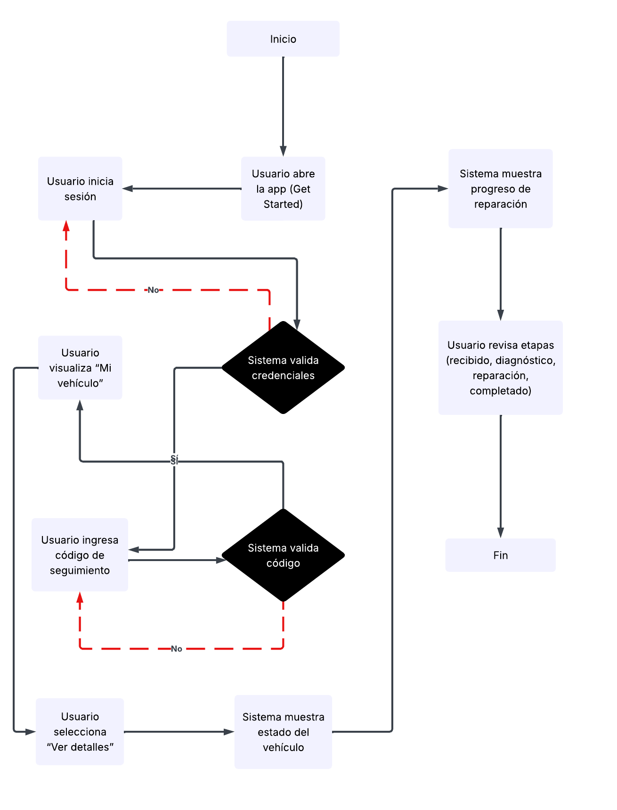

<table>
  <tr>
    <td class="header">User Persona</td>
    <td>Cliente - dueño del vehículo</td>
    <td class="header">Número</td>
    <td>2</td>
  </tr>
  <tr>
    <td class="header">User Goal</td>
    <td colspan="3" class="italic bold">
      Visualizar el detalle completo del servicio del vehículo y realizar el pago correspondiente, para entender los trabajos realizados, conocer los costos y completar el proceso de manera digital y segura.
    </td>
  </tr>
  <tr>
    <td class="header">Happy path</td>
    <td colspan="3">
Una vez iniciado sesion y validado el codigo, el usuario accede a la pantalla principal “Mi vehículo”, donde puede visualizar un resumen del estado del servicio. Desde esta vista, el cliente selecciona la opción “Ver detalles”, lo que lo dirige a la pantalla de detalle del servicio.

En esta sección, el sistema muestra información específica del vehículo y del proceso de mantenimiento, incluyendo:

- Lista de tareas realizadas o en progreso
- Estado de cada actividad
- Notas del técnico
- Evidencias visuales (imágenes de referencia)

Desde esta pantalla, el usuario puede acceder al resumen del servicio, donde se presenta un desglose claro de los costos, incluyendo:

- Tipo de servicios realizados
- Precio por cada tarea
- Subtotal o costo total
- Estado general del servicio

A continuación, el cliente tiene la opción de proceder con el pago mediante el botón “Pagar”, lo que lo redirige a la pantalla de método de pago. En esta vista, el usuario puede seleccionar entre distintas opciones (tarjeta, billeteras digitales o pago en taller).

Finalmente, al confirmar la transacción, el sistema muestra una pantalla de confirmación de pago exitoso, cerrando el flujo de manera satisfactoria.
    </td>
  </tr>
</table>

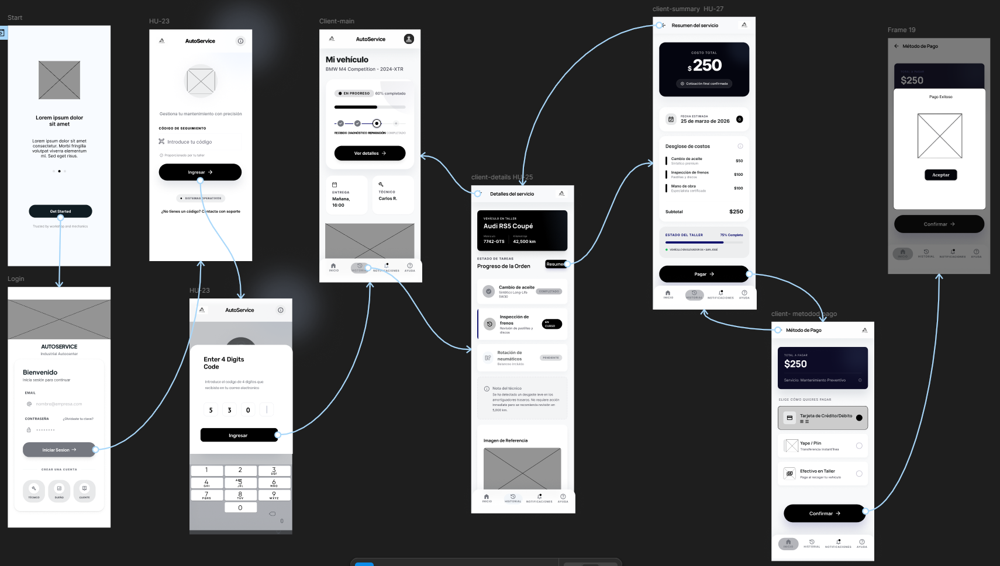
Wireflow Diagram - 2   
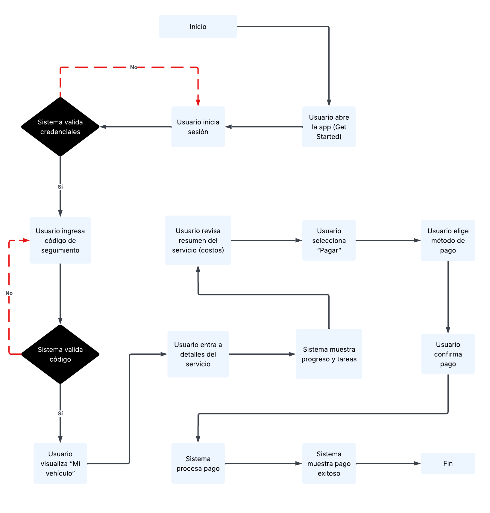

<table>
  <tr>
    <td class="header">User Persona</td>
    <td>Cliente - dueño del vehículo</td>
    <td class="header">Número</td>
    <td>3</td>
  </tr>
  <tr>
    <td class="header">User Goal</td>
    <td colspan="3" class="italic bold">
     Agendar cita de mantenimiento para un vehículo, para seleccionar una fecha y hora disponible de manera rápida y asegurar la atención en el taller sin necesidad de coordinación manual
    </td>
  </tr>
  <tr>
    <td class="header">Happy path</td>
    <td colspan="3">
     Tras completar el proceso de iniciar sesion e iniciar con el codigo de 4 digitos, el cliente accede a la pantalla principal “Mi vehículo”, donde puede visualizar el estado general del servicio. Desde esta vista, el usuario navega hacia la sección de notificaciones, donde el sistema muestra alertas y mensajes relevantes relacionados con su vehículo.

Dentro de esta sección, el usuario identifica una notificación asociada a mantenimiento preventivo y selecciona la opción “Agendar ahora”, lo que lo redirige a la pantalla de agendamiento de cita.

En esta pantalla, el sistema permite al cliente:

- Visualizar el tipo de servicio (por ejemplo, mantenimiento de neumáticos)
- Seleccionar una fecha mediante un calendario interactivo
- Elegir un horario disponible
- Confirmar el vehículo asociado al servicio

Una vez completados estos campos, el usuario presiona el botón “Confirmar cita”, lo que lleva a una pantalla de confirmación exitosa, indicando que la cita ha sido registrada correctamente.
    </td>
  </tr>
</table>

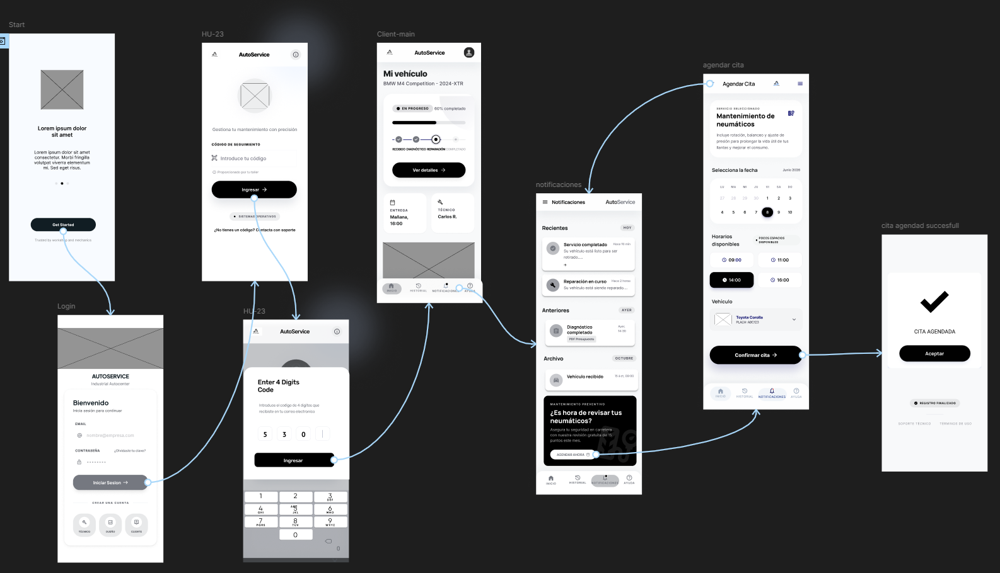
Wireflow Diagram - 3  
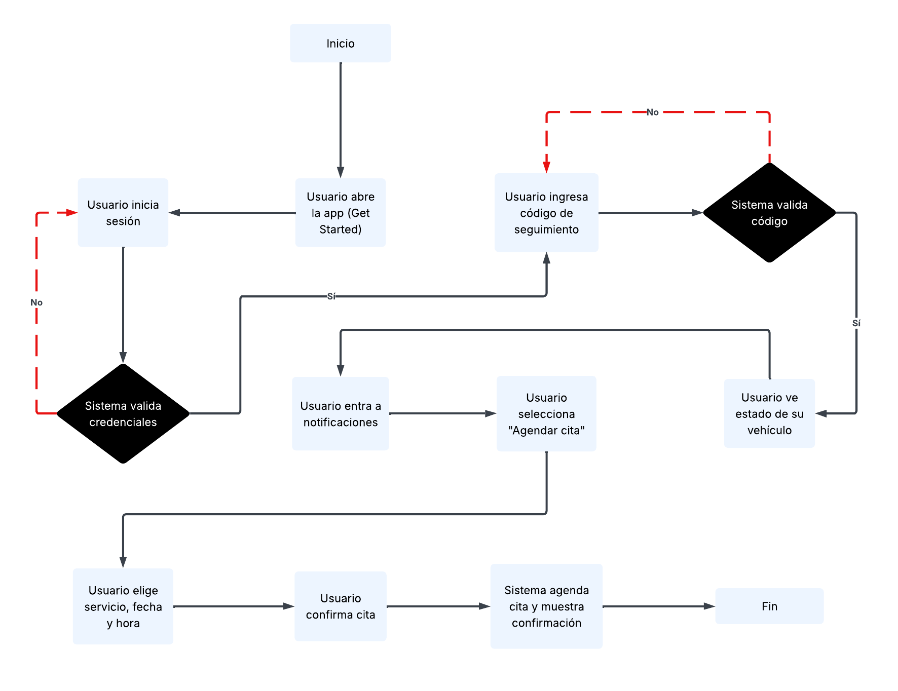

<table>
  <tr>
    <td class="header">User Persona</td>
    <td>Administrador - dueño del taller</td>
    <td class="header">Número</td>
    <td>4</td>
  </tr>
  <tr>
    <td class="header">User Goal</td>
    <td colspan="3" class="italic bold">
    </td>
  </tr>
  <tr>
    <td class="header">Happy path</td>
    <td colspan="3">
    El flujo inicia en la pantalla de bienvenida (Start), desde donde el usuario accede a la plataforma mediante el botón “Get Started”, siendo redirigido a la pantalla de inicio de sesión.

Una vez autenticado, el sistema dirige al administrador al panel de control (Dashboard), donde puede visualizar un resumen general del taller, incluyendo:

- Cantidad de vehículos activos
- Servicios en proceso
- Órdenes completadas
- Ingresos generados

Desde esta vista, el administrador accede a la sección de vehículos, donde el sistema muestra un listado completo con información resumida de cada unidad (placa, propietario, estado y progreso).

El usuario selecciona un vehículo específico mediante la opción “Ver detalles”, lo que lo redirige a la pantalla de detalle del vehículo. En esta vista, el sistema presenta:

- Información general del vehículo
- Estado actual del servicio
- Problema reportado
- Diagnóstico técnico
- Lista de tareas asociadas

Desde esta misma pantalla, el administrador puede presionar el botón “+ Agregar tarea”, lo que lo lleva a la pantalla de creación de nueva tarea.

En esta sección, el usuario registra:

- Nombre de la tarea
- Descripción del servicio
- Estado (pendiente, en proceso o completado)
- Tiempo estimado

Una vez completados los campos, el administrador presiona “Siguiente”, y el sistema lo redirige a la pantalla de orden de trabajo, donde se visualiza el conjunto completo de tareas asociadas al vehículo, junto con su estado actual y progreso global.
    </td>
  </tr>
</table>

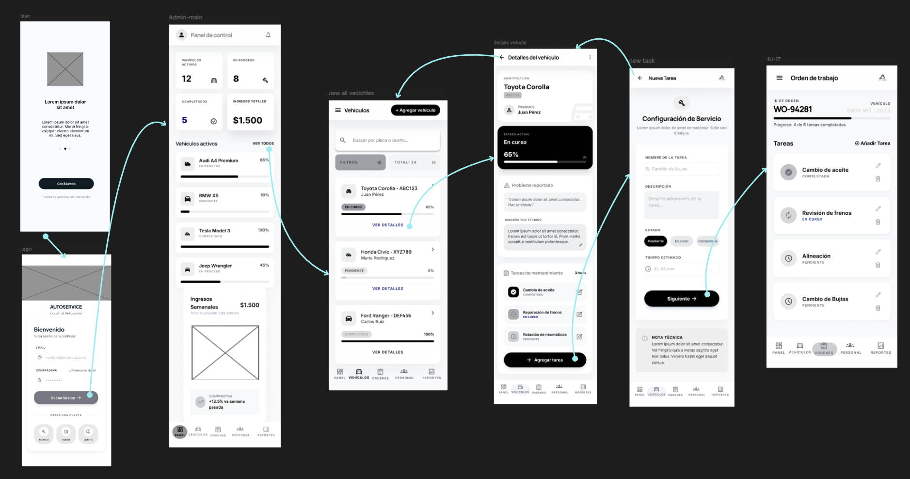
Wireflow Diagram - 4  
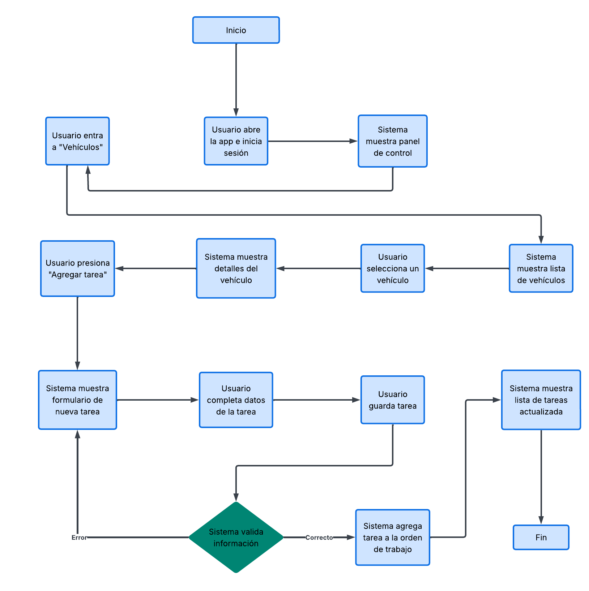

<table>
  <tr>
    <td class="header">User Persona</td>
    <td>Administrador - dueño del taller</td>
    <td class="header">Número</td>
    <td>5</td>
  </tr>
  <tr>
    <td class="header">User Goal</td>
    <td colspan="3" class="italic bold">
    Registrar un nuevo vehículo en el sistema, ingresando la información del vehículo y del propietario, con el fin de gestionar correctamente los servicios y mantener actualizado el control de vehículos atendidos.
    </td>
  </tr>
  <tr>
    <td class="header">Happy path</td>
    <td colspan="3">
    El flujo inicia en la pantalla de bienvenida (Start), donde el usuario accede a la aplicación mediante el botón “Get Started”. A continuación, se presenta la pantalla de inicio de sesión (Login), en la cual el usuario ingresa su correo electrónico y contraseña para autenticarse en el sistema.

Una vez autenticado, el usuario es dirigido al panel de control (Dashboard), donde puede visualizar un resumen general del estado del taller, incluyendo vehículos activos, servicios en proceso, completados e ingresos. Desde esta pantalla, el usuario puede navegar hacia el módulo de gestión de vehículos.

Al ingresar a la sección “Vehículos”, se muestra una lista con los vehículos registrados, junto con su estado y detalles básicos. En esta pantalla, el usuario tiene la opción de presionar el botón “Agregar vehículo”, lo que lo dirige al formulario de registro.

En la pantalla de “Agregar vehículo”, el usuario completa los datos requeridos, los cuales están divididos en dos secciones:

- Información del vehículo (placa, marca, modelo, año).
- Información del propietario (nombre completo, teléfono, entre otros)

Una vez completados los campos, el usuario selecciona la opción “Guardar vehículo”. Como resultado de esta acción, el sistema procesa la información y muestra una nueva pantalla con el estado actualizado, confirmando que el vehículo ha sido registrado correctamente.

Finalmente, se presenta un mensaje de confirmación (“Vehículo registrado correctamente”) junto con una opción para aceptar, lo que permite al usuario regresar al sistema y continuar con otras tareas.
    </td>
  </tr>
</table>

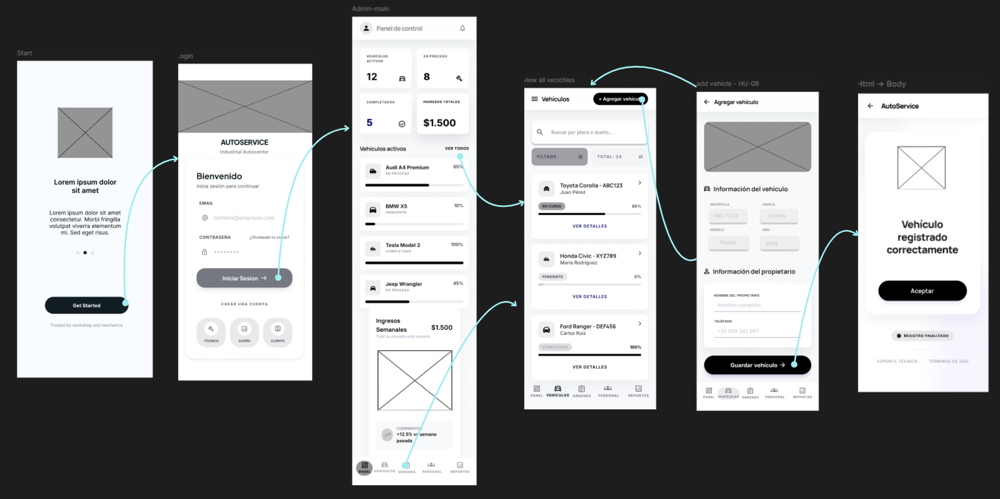
Wireflow Diagram - 5  
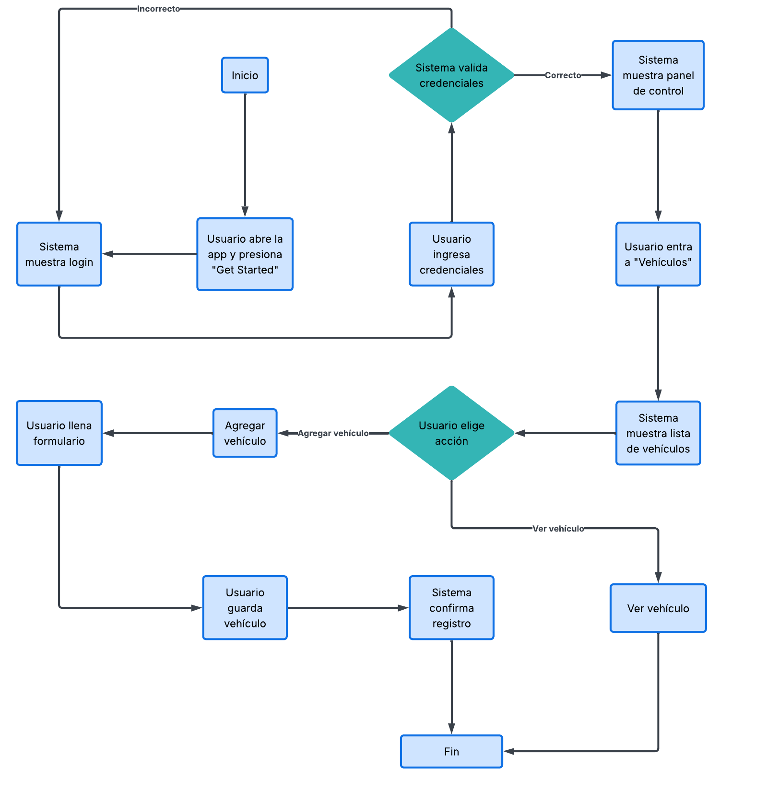

<table>
  <tr>
    <td class="header">User Persona</td>
    <td>Administrador - dueño del taller</td>
    <td class="header">Número</td>
    <td>6</td>
  </tr>
  <tr>
    <td class="header">User Goal</td>
    <td colspan="3" class="italic bold">
    Seguimiento a las tareas y eliminar una orden de trabajo, para mantener actualizado el estado de los servicios y optimizar la gestión operativa del taller
    </td>
  </tr>
  <tr>
    <td class="header">Happy path</td>
    <td colspan="3">
    
El usuario al iniciar tendra que iniciar sesion para poder ingresar.
Una vez dentro del sistema, el usuario es dirigido al panel de control (panel), en el cual visualiza un resumen general del estado del taller, incluyendo vehículos activos, órdenes en proceso y métricas relevantes. Desde esta pantalla, el usuario navega hacia el módulo de “Órdenes”.

En la sección de órdenes de trabajo, el usuario accede al detalle de una orden específica, donde se muestra el identificador de la orden, el vehículo asociado y el progreso de las tareas asignadas. En esta vista, el usuario puede visualizar la lista de tareas, cada una con su estado (completada, en curso o pendiente).

El usuario puede gestionar estas tareas realizando diferentes acciones, como editar una tarea existente, marcar su estado o eliminarla mediante los controles disponibles en cada ítem. Asimismo, puede añadir nuevas tareas si es necesario.

Dentro de este flujo, también se contempla la posibilidad de eliminar una orden de trabajo, acción que se ejecuta a través de una opción disponible en la interfaz (generalmente asociada a un ícono de eliminación). Al realizar esta acción, el sistema actualiza el estado eliminando la orden del listado y reflejando el cambio en la interfaz.
Finalmente, el sistema mantiene actualizado el progreso de la orden en función de las tareas gestionadas, permitiendo al usuario tener control completo sobre el ciclo de trabajo.
    </td>
  </tr>
</table>

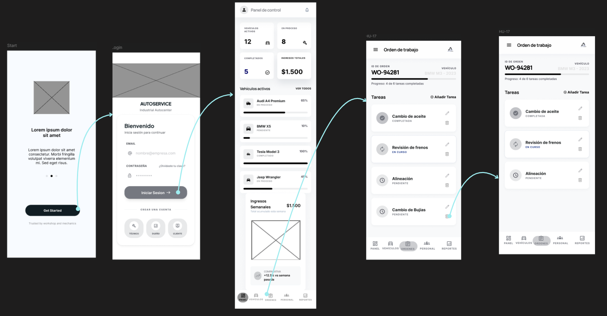
Wireflow Diagram - 6  
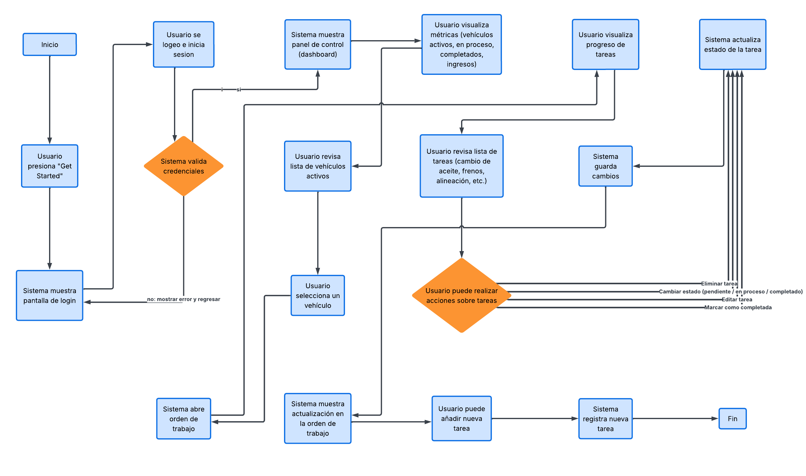

<table>
  <tr>
    <td class="header">User Persona</td>
    <td>Administrador - dueño del taller</td>
    <td class="header">Número</td>
    <td>7</td>
  </tr>
  <tr>
    <td class="header">User Goal</td>
    <td colspan="3" class="italic bold">
    Asignar una tarea a un mecánico disponible, seleccionar al personal adecuado según su especialidad, para asegurar una correcta distribución del trabajo y una atención eficiente de los servicios
    </td>
  </tr>
  <tr>
    <td class="header">Happy path</td>
    <td colspan="3">
    El flujo inicia en la pantalla de bienvenida (Start), donde el usuario accede a la aplicación mediante el botón “Get Started”. Seguidamente, se presenta la pantalla de inicio de sesión (Login), en la cual el usuario ingresa sus credenciales para autenticarse en el sistema.

Una vez dentro, el usuario es dirigido al panel de control (Dashboard), donde visualiza un resumen del estado del taller, incluyendo vehículos activos, servicios en proceso y métricas generales. Desde esta vista, el usuario puede navegar hacia la sección correspondiente para gestionar el personal o las órdenes de trabajo.

Posteriormente, el usuario accede a la pantalla de “Asignar mecánico”, donde se muestra la información del vehículo en espera junto con el tipo de servicio requerido. En esta misma pantalla, se presenta una lista de personal disponible, incluyendo datos relevantes como nombre del mecánico, especialidad y estado (disponible u ocupado).

El usuario selecciona al mecánico más adecuado en función de la tarea a realizar y su disponibilidad. Una vez hecha la selección, presiona el botón “Asignar tarea”, lo que ejecuta la acción dentro del sistema.

Como resultado, el sistema procesa la asignación y muestra una nueva pantalla con el estado actualizado, confirmando que la tarea ha sido registrada correctamente. Finalmente, el usuario puede aceptar la confirmación y continuar gestionando otras actividades dentro del sistema.
    </td>
  </tr>
</table>

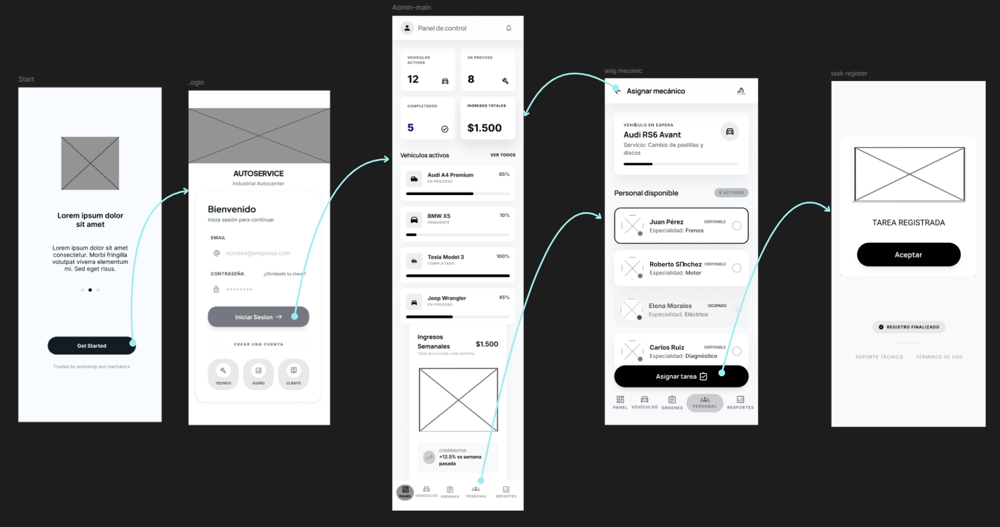
Wireflow Diagram - 7  
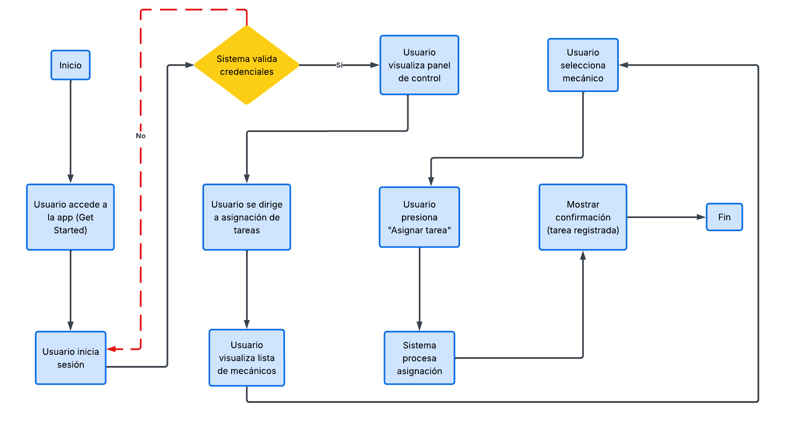

<table>
  <tr>
    <td class="header">User Persona</td>
    <td>Administrador - dueño del taller</td>
    <td class="header">Número</td>
    <td>8</td>
  </tr>
  <tr>
    <td class="header">User Goal</td>
    <td colspan="3" class="italic bold">
    Registrar un nuevo mecánico en el sistema, ingresando sus datos personales, especialidad y estado inicial, para gestionar adecuadamente el equipo de trabajo y asignar tareas de manera eficiente.
    </td>
  </tr>
  <tr>
    <td class="header">Happy path</td>
    <td colspan="3">
    El flujo inicia en la pantalla de bienvenida (Start), donde el usuario accede a la aplicación mediante el botón “Get Started”. Luego, se presenta la pantalla de inicio de sesión (Login), en la cual el usuario ingresa sus credenciales para autenticarse.

Una vez dentro del sistema, el usuario es dirigido al panel de control (Panel), donde puede visualizar un resumen del estado del taller, incluyendo métricas generales como vehículos activos, servicios en proceso y resultados económicos. Desde esta pantalla, el usuario navega hacia el módulo de “Personal”.

En la sección de gestión de personal, el usuario visualiza la lista de mecánicos registrados, junto con información relevante como su especialidad y estado (disponible u ocupado). En esta pantalla, el usuario selecciona la opción “Añadir mecánico” para iniciar el proceso de registro.

A continuación, se muestra el formulario de “Agregar mecánico”, donde el usuario ingresa los datos requeridos, tales como nombre completo, especialidad, número de teléfono y estado inicial del trabajador. Una vez completada la información, el usuario presiona el botón “Guardar” para registrar al nuevo mecánico.

Como resultado de esta acción, el sistema procesa los datos y presenta una nueva pantalla con el estado actualizado, confirmando que el mecánico ha sido registrado correctamente. Finalmente, el usuario puede aceptar la confirmación y continuar gestionando otras funcionalidades del sistema.
    </td>
  </tr>
</table>

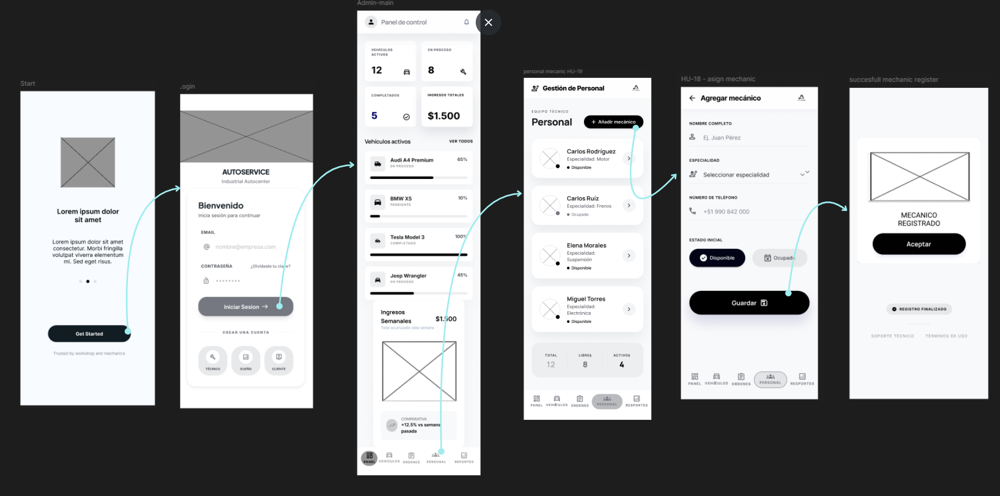

Wireflow Diagram - 8
  
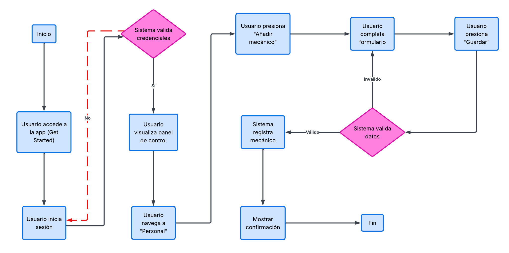

#### 4.4.3. Web Applications Mock-ups
[Pendiente]
#### 4.4.4. Web Applications User Flow Diagrams

<table>
  <tr>
    <td class="header">User Persona</td>
    <td>Cliente - propietario del vehículo</td>
    <td class="header">Número</td>
    <td>1</td>
  </tr>
  <tr>
    <td class="header">User Goal</td>
    <td colspan="3" class="italic bold">
    Ingresar al sistema, visualizar y consultar el estado de mi vehículo mediante un código de seguimiento, para conocer el progreso del servicio, el diagnóstico y la fecha estimada de entrega sin necesidad de contactar directamente al taller.
    </td>
  </tr>
  <tr>
    <td class="header">Happy path</td>
    <td colspan="3">
    El usuario accede a la pantalla de inicio de sesión de la aplicación AutoService. Ingresa sus credenciales y presiona el botón “Login” para autenticarse en el sistema.
    Una vez dentro, el usuario es dirigido a la pantalla principal (dashboard), donde se le presentan distintas opciones. Para cumplir su objetivo, selecciona la opción “Consultar estado del vehículo”.
    El sistema lo redirige a la pantalla de consulta, donde se le solicita ingresar un código único asociado a su servicio. El usuario introduce el código y presiona el botón “Consultar estado”.
    Finalmente, el sistema muestra la pantalla de resultados, donde el usuario puede visualizar en tiempo real el estado de su vehículo, incluyendo detalles de las tareas realizadas, el progreso del servicio, costos asociados y tiempos estimados.
    </td>
  </tr>
  <tr>
    <td class="header">Unhappy Paths</td>
    <td colspan="3">
    Si el usuario ingresa credenciales incorrectas en la pantalla de inicio de sesión, el sistema muestra un mensaje de error y solicita reintentar el acceso.
    En la pantalla de consulta, si el usuario ingresa un código inválido o inexistente, el sistema despliega una notificación indicando que el código no es válido y permite volver a intentarlo.
    Si ocurre un problema de conexión o el sistema no puede recuperar la información, se muestra un mensaje de error indicando la imposibilidad de obtener el estado del vehículo en ese momento, sugiriendo intentar más tarde. 
    Consideraciones:
    <ul>
    <li>El usuario debe estar previamente registrado para poder acceder al sistema.</li>
    <li>El código de consulta debe ser válido y estar asociado a un servicio activo.</li>
    <li>La información mostrada depende de la disponibilidad y actualización en tiempo real del sistema.</li></ul>
    </td>
  </tr>
</table>

<table>
  <tr>
    <td class="header">User Persona</td>
    <td>Cliente - propietario del vehículo</td>
    <td class="header">Número</td>
    <td>2</td>
  </tr>
  <tr>
    <td class="header">User Goal</td>
    <td colspan="3" class="italic bold">
      Agendar una cita para el servicio de su vehículo de manera rápida y sencilla, seleccionando fecha, hora y proporcionando sus datos personales.
    </td>
  </tr>
  <tr>
    <td class="header">Happy path</td>
    <td colspan="3">
    El usuario accede a la pantalla de inicio de sesión de la plataforma AutoService. Ingresa sus credenciales y presiona el botón “Login” para acceder al sistema.
Una vez autenticado, el usuario es dirigido al dashboard principal, donde visualiza distintas opciones disponibles. Para cumplir su objetivo, selecciona la opción “Agendar cita”.
El sistema lo redirige a la pantalla de agendamiento, donde el usuario debe completar un formulario inicial seleccionando información clave como la fecha, la hora y el tipo de servicio requerido. Una vez completados estos campos, presiona el botón “Siguiente”.
En la siguiente pantalla, el usuario ingresa sus datos personales, incluyendo nombre, teléfono, correo electrónico y la información del vehículo (placa, marca y modelo). Luego de completar el formulario, presiona nuevamente el botón “Siguiente”.
Finalmente, el sistema muestra una pantalla de confirmación indicando que la cita ha sido agendada correctamente, junto con un resumen de los datos ingresados (fecha y hora). El usuario puede optar por consultar el estado del servicio o volver al inicio.
    </td>
  </tr>
  <tr>
    <td class="header">Unhappy Paths</td>
    <td colspan="3">
    Si el usuario ingresa credenciales incorrectas al iniciar sesión, el sistema muestra un mensaje de error y solicita reintentar.
Si el usuario no completa los campos obligatorios en el formulario de agendamiento (fecha, hora o tipo de servicio), el sistema impide avanzar y resalta los campos faltantes.
En caso de seleccionar una fecha u horario no disponible, el sistema notifica al usuario y le solicita elegir otra opción válida.
Si el uszario deja incompletos los datos personales o ingresa información inválida (por ejemplo, correo con formato incorrecto), el sistema muestra mensajes de validación antes de permitir continuar.
Si ocurre un error en el sistema al momento de confirmar la cita, se muestra un mensaje indicando que no fue posible completar la operación y se sugiere intentar nuevamente.
    </td>
  </tr>
</table>

<table>
  <tr>
    <td class="header">User Persona</td>
    <td>Administrador - dueño del taller</td>
    <td class="header">Número</td>
    <td>3</td>
  </tr>
  <tr>
    <td class="header">User Goal</td>
    <td colspan="3" class="italic bold">
      Registro y gestion de tareas de servicio para los vehículos, asignando mecánicos y manteniendo el control del estado de los trabajos en curso.
    </td>
  </tr>
  <tr>
    <td class="header">Happy path</td>
    <td colspan="3">
El flujo inicia cuando el administrador accede a la plataforma AutoService mediante la pantalla de inicio de sesión. Ingresa sus credenciales y presiona el botón “Login” para acceder al sistema.
Una vez autenticado, es dirigido al dashboard principal, donde puede visualizar un resumen de la operación del taller, incluyendo métricas, vehículos en proceso y estado general de los servicios.
Desde el menú de navegación, el administrador selecciona la opción de “Tareas” para acceder al panel de gestión. En esta sección se muestra un listado con todas las tareas registradas, junto con información relevante como vehículo asociado, mecánico asignado, estado y progreso.
Para crear una nueva tarea, el administrador presiona el botón “Crear tarea”. El sistema despliega un formulario donde debe ingresar los detalles de la tarea, como el tipo de servicio, descripción, vehículo asociado y el mecánico responsable.
Una vez completado el formulario, el administrador confirma la acción presionando nuevamente el botón “Crear tarea”. Finalmente, el sistema muestra un mensaje de confirmación indicando que la tarea ha sido creada correctamente, y esta pasa a formar parte del listado de tareas activas.
    </td>
  </tr>
  <tr>
    <td class="header">Unhappy Paths</td>
    <td colspan="3">
    Si el administrador ingresa credenciales incorrectas al iniciar sesión, el sistema muestra un mensaje de error y solicita reintentar el acceso.
Si intenta crear una tarea sin completar los campos obligatorios del formulario, el sistema resalta los campos faltantes e impide continuar hasta que la información sea válida.
En caso de seleccionar un vehículo o mecánico no disponible o no registrado en el sistema, se muestra un mensaje indicando el problema y se solicita corregir la información.
Si ocurre un error del sistema al momento de guardar la tarea, se notifica al usuario que la acción no pudo completarse y se sugiere intentar nuevamente.
    </td>
  </tr>
</table>

### 4.5. Web Applications Prototyping
[Pendiente]

### 4.6. Domain-Driven Software Architecture

#### 4.6.1. Design-Level EventStorming
[Pendiente]

#### 4.6.2. Software Architecture Context Diagram
[Pendiente]

#### 4.6.3. Software Architecture Container Diagrams
[Pendiente]

#### 4.6.4. Software Architecture Components Diagrams
[Pendiente]

### 4.7. Software Object-Oriented Design

#### 4.7.1. Class Diagrams
[Pendiente]

### 4.8. Database Design

#### 4.8.1. Database Diagrams
[Pendiente]